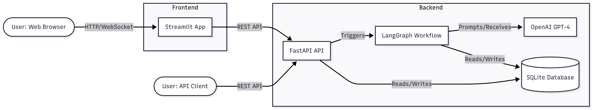
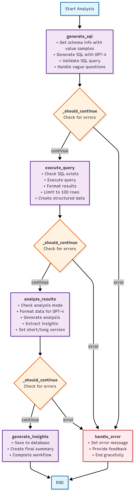

# 🤖 GPT-4 Data Analyst Application

## 🚀 Features

- **SQL Query Generation**: Translation of a natural language request to an SQL query
- **Simple Analysis Runner**: Runs simple analysis, shares insights and returns recommendations to the user
- **LangGraph Workflow**: Orchestrated analysis process with error handling
- **Pre-loaded Data**: Automatical loading of accrual accounts Excel data
- **Interactive UI**: Streamlit frontend with basic chat-like analytics functionality

## 📋 Prerequisites

- Python 3.11+
- OpenAI API key
- The accrual accounts Excel file: `data/Data Dump - Accrual Accounts (1) (1) (2).xlsx`

## 🛠️ Installation


1. **Adjust OPENAI_API_KEY**
   Open src/pwcproject/config.py file and paste the key into `OPENAI_API_KEY` variable

2. **Install dependencies**:
   ```bash
   pip install -e .
   ```

## Quick Start (chose one option)

### Option 1: Using the main script

1. **Start the solution**:
   ```bash
   python main.py
   ```


### Option 2: Direct commands

1. **Start the API server**:
   ```bash
   uvicorn src.pwcproject.api:app --reload --host 0.0.0.0 --port 8000
   ```

2. **Start the Streamlit frontend**:
   ```bash
   streamlit run src/pwcproject/streamlit_app.py --server.port 8501
   ```

## Usage

### Web Interface (Streamlit)

1. Open your browser and go to `http://localhost:8501`
2. Navigate through the different pages:
   - **Dashboard**: Simplified data overview and recently computed analysis
   - **Data Overview**: View data schema and sample data
   - **Analysis**: Ask questions in natural language to get data or analysis


### API Endpoints

- `GET /data-info` - Get data source information
- `POST /analyze` - E2E analysis of a user request
- `GET /analysis-history` - Get analysis history


## 🏗️ Architecture

### 🏛️ High-Level Architecture

This PoC consists of the following main components and their communication flow:



**Description:**
- Users interact via a web browser (Streamlit frontend) or via API
- The Streamlit app communicates with the FastAPI backend using REST API calls
- The FastAPI backend orchestrates the analysis workflow using LangGraph
- The workflow interacts with both the OpenAI GPT-4 LLM (for analysis) and the SQLite database (for data storage and queries)
- All persistent data is stored in SQLite

### LangGraph Workflow

The application uses a LangGraph workflow to orchestrate the data analysis process. Here's the complete flow:



#### Workflow Description

**Flow Overview:**
1. **Entry Point**: `generate_sql` - Converts natural language questions to SQL queries
2. **Conditional Flow**: Each node checks for errors using `_should_continue` function
3. **Main Path**: `generate_sql` → `execute_query` → `analyze_results` → `generate_insights`
4. **Error Path**: Any node can redirect to `handle_error` if issues occur

**Node Functions:**

- **🔍 `generate_sql`**: Gets database schema and sample data, uses GPT-4 to generate SQL from natural language, validates and corrects SQL if needed, sets error state if question is too vague
- **⚡ `execute_query`**: Executes the generated SQL query, formats results (limits to 100 rows for PoC), creates structured result object with metadata
- **📊 `analyze_results`**: Checks if analysis mode is enabled (see `Analysis Types`), formats query results for GPT-4 analysis, generates insights and recommendations, sets short/long version display flag
- **💡 `generate_insights`**: Saves analysis to database, creates final summary, completes the workflow
- **⚠️ `handle_error`**: Centralized error handling, provides user-friendly error messages, ends workflow gracefully

**Key Features:**
- **Error Resilience**: Each step can handle failures gracefully
- **Conditional Logic**: Smart routing based on success/error states
- **State Management**: Maintains context throughout the workflow
- **Flexible Analysis**: Supports both query-only and full analysis modes
- **Version Control**: Handles short/long analysis versions

This workflow ensures robust data analysis with comprehensive error handling and user-friendly feedback.


## 🔧 Configuration


### Database

The application uses SQLite by default. The database file (`data_analyst.db`) is created automatically and contains:

- `data_sources`: Information about loaded data sources
- `analysis_history`: History of all analyses performed
- `accrual_accounts_data`: The actual accrual accounts data

## 📈 Analysis Types

The application can run in 2 modes which can be switched by a toggle called `Enable GPT-4 Analysis`. 

- **GPT-4 analysis** is recommended for analysis of open-ended questions which require understanding of the data values retrieved from the database and context of the dataset, such as identification of incorrect data points
- **Standard mode** (toggle off) is recommended for simple deterministic data queries, such as data aggregation, finding max values etc.


## Additional features
- **Analysis process transparency**: The user can follow what what was the basis of the analysis i.e. what was the initial query and data used for the data insights and user recommendations.


### Components

- **`config.py`**: Configuration management
- **`models.py`**: Data models and schemas
- **`database.py`**: Database operations and data loading
- **`llm.py`**: GPT-4 integration for analysis
- **`workflow.py`**: LangGraph workflow orchestration
- **`api.py`**: FastAPI REST endpoints
- **`streamlit_app.py`**: Web interface


## 📝 Development

### Project Structure

```
pwcProject/
├── data/                         # Data files
├── src/pwcproject/               # Source code
│   ├── __init__.py
│   ├── api.py                    # FastAPI application
│   ├── config.py                 # Configuration
│   ├── database.py               # Database operations
│   ├── llm.py                    # GPT-4 integration
│   ├── models.py                 # Data models
│   ├── streamlit_app.py          # Streamlit frontend
│   └── workflow.py               # LangGraph workflow
├── main.py                       # Entry point
├── pyproject.toml               # Project configuration
└── README.md                    # This file
```

