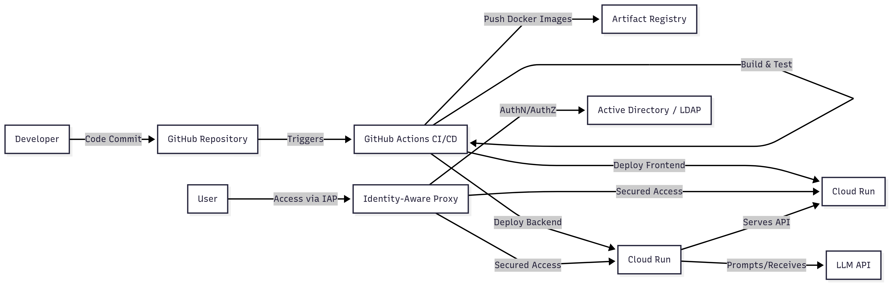

# Target Solution – Technical Design

## Overview

This solution provides a secure, scalable, and cloud-native data analysis platform leveraging LLM APIs and multiple database backends. It is designed for moderate concurrency (≤100 users) and is optimized for rapid deployment and maintainability on Google Cloud Platform (GCP).

---

## Architecture Diagram

*DB component should be outside of backend component as it connects to an external/existing DB
---

## Key Components

### 1. **Frontend**
- **Options:** React, Vue, or python low-code (Streamlit, Gradio)
- **Deployment:** Cloud Run
- **Authentication:** Integrated with Google Identity-Aware Proxy (IAP) for user group-based access control

### 2. **Backend**
- **Framework:** Python; backend frameworks tbd with customer stack (i.e. FastAPI, SQLAlchemy etc.)
- **Deployment:** GCP Cloud Run (recommended for containerized workloads and easy scaling)
- **Authentication:** Protected by IAP, only accessible to authorized user groups

### 3. **Workflow Engine**
- **Logic:** Orchestrates analysis, database access, and LLM API calls

### 4. **Databases**
- **Options:** Cloud SQL (Postgres/MySQL), BigQuery, or other GCP-supported data warehouses, depending on customer infra setup

### 5. **LLM API**
- **Type:** External service (e.g., OpenAI, Azure OpenAI, Anthropic, GCP)

### 6. **CI/CD & Artifacts**
- **Source Control:** GitHub
- **CI/CD:** GitHub Actions runners for build, test, and deploy
- **Artifact Storage:** GCP Artifact Registry for Docker images and other build artifacts

---

## Security&Access

- **User Authentication & Authorization:**  
  - Google Identity-Aware Proxy (IAP) enforces access at the user group level.
  - Only authorized users/groups can access the frontend and backend.
- **API Security:**  
  - All API endpoints are protected behind IAP.

---

## Scalability & Performance

- **Concurrency:** Designed for up to 100 concurrent users, but bottlenecks expected in LLM API rate limits and response time
- **Autoscaling:** Cloud Run automatically scales backend containers based on demand (but most likely will never happen)

---

## Deployment Flow

1. **Code Commit:** Developers push code to GitHub.
2. **CI/CD Pipeline:** GitHub Actions build, test, and push Docker images to Artifact Registry.
3. **Deployment:** Images are deployed to Cloud Run (backend) or App Engine/Cloud Run (frontend).
4. **Access Control:** IAP ensures only authorized users can access the application.

---

## Frontend Technology Choice

- **If UI is simple and user count is low:**  
  Use Streamlit or Gradio for rapid development and deployment (benefit: no need for dedicated frontend engineer)
- **If a richer, more sofisticated UI is needed:**  
  Use React or Vue, deployed on Cloud Run.